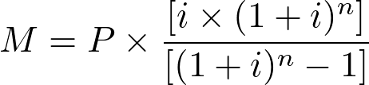

<!-- README.md is generated from README.Rmd. Please edit that file -->

# mortgager

<!-- badges: start -->

<!-- badges: end -->

This package obtains various values such as monthly mortgage payment
amounts, downpayment amounts, minimum income required for affordable
home-ownership etc.

The formula used for calculating monthly home-ownership payment amounts
is based on a widely accepted monthly mortgage formula, which here is
adapted from that seen on the [Nerdwallet
website](https://www.nerdwallet.com/mortgages/mortgage-calculator/calculate-mortgage-payment).



**Where:**

  - **M** = Monthly mortgage amount
  - **P** = Principal amount, ie total loan amount
  - **i** = Monthly mortgage interest rate
  - **n** = Number of payments across loan duration. (This is generally
    assumed to be number of months. For example, a loan with a payback
    period of 30 years, will have 360 payments in total)

In addition to the monthly mortgage payment, there are other costs
associated with home-ownership which are then added to calculate total
home-ownership costs, namely:

  - **PMI factor** – only for loans with a downpayment less than 20%,
    assumed at 7.5% annually on the mortgage amount
  - **Home-owners** insurance – assumed at $1000 annually
  - **Condo fees** – applicable only to condominium sales, assumed at
    $1000 annually
  - **Property Tax** - an annual percentage amount taxed on assessed
    property value dependent on the jurisdiction the unit is located in.

## Installation

You can install the released version of mortgager with:

``` r
devtools::install_github("aseemdeodhar/mortgager")
```

## mortgager

Load the  package with this line:

``` r
library(mortgager)
```

## Examples for each function:

### mortgager::monthlypayment()

calculates monthly home-ownership costs based on tax rates, interest
rates, downpayment rate, and home cost price.

``` r
monthlypayment(mortgage_rate = 3,
               property_tax = 12,
               downpayment_rate = .2,
               home_price = 450000)
#> [1] 2051.108
```

### mortgager::max\_homeprice()

calculates maximum affordable home price based on annual income with a
set monthly housing cost percentage (default is 30%).

``` r
max_homeprice(annualinc = c(61000, 75000, 22330, 120000),
              mortgage_rate = 2.7,
              property_tax = 6)
#> # A tibble: 4 x 4
#>   income_level atincome  at80pc at120pc
#>          <dbl>    <dbl>   <dbl>   <dbl>
#> 1        61000  224144. 179316. 268973.
#> 2        75000  278561. 222849. 334273.
#> 3        22330   73838.  59070.  88606.
#> 4       120000  453471. 362777. 544166.
```

### mortgager::downpayment\_amt()

calculates the total downpayment amount based on sale price and
downpayment rate

``` r
downpayment_amt(home_price = 250000,
                downpayment_rate = 0.10)
#> [1] 25000
```

### mortgager::min\_income()

*Deprecated. Use reqd\_income() instead, and specify monthly cost rate*

calculates the minimum annual income required for total housing costs to
remain at or below 30% of household income.

``` r
min_income(2000)
#> [1] 80000
```

### mortgager::burd\_income()

*Deprecated. Use reqd\_income() instead, and specify monthly cost rate*

calculates the minimum annual income required for total housing costs to
remain at or below 50% of household income.

``` r
burd_income(2000)
#> [1] 48000
```

### mortgager::reqd\_income()

calculates the minimum annual income required for total housing costs to
remain at or below a set proportion of household income.

``` r
reqd_income(monthlypayment = 2000,
            housing_cost_rate = 0.30)
#> [1] 80000
```
